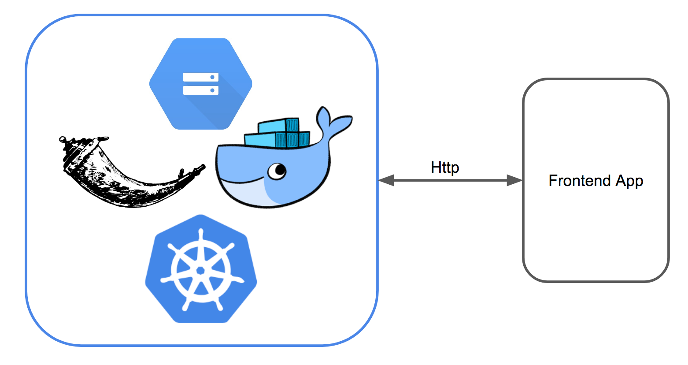

+++
title = "Back-End Architecture"
date = "2018-07-27"
author = "iCareer Climber Team"
+++

### The Application

The backend is a Flask application whose primary purpose is to accept job description inputs and output job similarity scores using the model.  This allows us to serve up model results for consumption by the frontend application.



The application is built as a docker container which can easily be tested locally and then uploaded to Google Cloud Container Registry and deployed to Google Cloud using Kubernetes.

The models are stored in a Google Cloud Storage bucket, which is mounted to the application container using [FUSE](https://cloud.google.com/storage/docs/gcs-fuse).

The backend is a basic REST api which accepts and serves JSON data.

```bash
$ curl -XPOST -H 'Content-Type: application/json' -d '{"experience":[{"description": "organizing projects with agile and scrum methodologies"}]}' 35.230.26.112/model/similar_jobs | python -m json.tool | head -22
  % Total    % Received % Xferd  Average Speed   Time    Time     Time  Current
                                 Dload  Upload   Total   Spent    Left  Speed
100  7535  100  7445  100    90   8638    104 --:--:-- --:--:-- --:--:--  8636
{
    "results": [
        {
            "probability": 0.24560086752139812,
            "title": "technical project manager"
        },
        {
            "probability": 0.09362546705168302,
            "title": "quality assurance engineer"
        },
        {
            "probability": 0.07340485510020563,
            "title": "quality assurance analyst"
        },
        {
            "probability": 0.05443605668438692,
            "title": "ux engineer"
        },
        {
            "probability": 0.05370892876346319,
            "title": "program manager"
        },
```

images built using docker
uploaded to google cloud container storage
